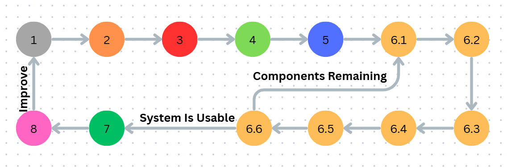

# QUALINE (v2.0.0)

## i. SDLC Stages

$$ \fbox{1) Objectives} $$
$$ \downarrow $$
$$ \fbox{2) Standard Research} $$
$$ \downarrow $$
$$ \fbox{3) Required Tool Listing} $$
$$ \downarrow $$
$$ \fbox{4) User Design} $$
$$ \downarrow $$
$$ \fbox{5) Component Distribution} $$
$$ \downarrow $$
$$ \fbox{6) Implementation} $$
$$ \downarrow $$
$$ \fbox{7) Product Deployment} $$
$$ \downarrow $$
$$ \fbox{8) Feedback and Continuation} $$

## ii. Ideal Software Attributes

- **Standards** (from stage 1)
- **Portability** (from stage 1,5)
- **User friendly** (from stage 4)
- **Scalability** (from stage 5)
- **Cohesiveness** (from stage 5)
- **Low coupling** (from stage 5,6)
- **Optimization** (from stage 5,6)
- **Clean documentation** (from stage 6,7)
- **Security** (from stage 6,8)

## iii. Stages Summary

### 1. Objectives:

- **1.1** Set objectives of the project.
- **1.2** Write what are common features.
- **1.3** Write what are unique features.

### 2. Standard Research:

- **2.1** Find research source.
- **2.2** Study the standards.
- **2.3** Write them down.
- **2.4** Make modifications.
- **2.5** Set rules & conventions.

### 3. Required Tools Listing:

- **3.1** List the must required tools/dependencies.
- **3.2** List the extra tools/dependecies.

### 4. User Design:

- **4.1** Know the target audience.
- **4.2** Study other software in same category.
- **4.3** Design user friendly interface.

### 5. Component Distribution:

- **5.1** Make & finalize architecture.
- **5.2** Distribute work to libraries.
- **5.3** List possibly coming sub-components.
- **5.4** Serially arrange sequence of implementation.
- **5.5** Write rules for code structure.

### 6. Implementation:

- **6.1** Document sequential algorithms for a sub-component.
- **6.2** Make test cases.
- **6.3** Write the code with precautions.
- **6.4** Test & debug.
- **6.5** Map flowchart & eliminate overheads.
- **6.6** Document performance & complexity analysis.
- **6.7** Repeat until all sub-components are covered.

### 7. Product Deployement:

- **7.1** Document contributing open-source tools with their licenses.
- **7.2** Deployement with any well-known versioning system.

### 8. Feedback & Continuation:

- **8.1** Public polls to be released among users for feedback.
- **8.2** Point of repeating whole SDLC cycle.

>**<u>NOTE</u>:**
> - Skill gathering is serially inserted when need becomes visible.
> - During stage 5 & 6, always consider the ideal software qualities.
> - Documentation must be written with professional & respectful tone.

## iv. Control Flow Diagram

---
